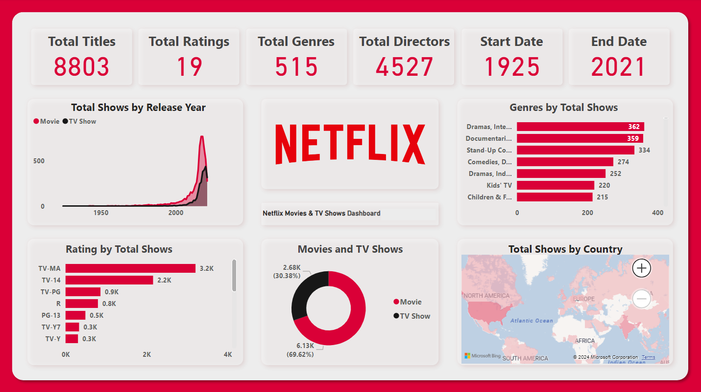

# 📊 Netflix Movies & TV Shows Dashboard

Welcome to the **Netflix Movies & TV Shows Dashboard** project! This interactive Power BI dashboard offers a comprehensive view of Netflix’s content catalog over time. The dashboard allows users to explore key insights across genres, ratings, content types, release years, and more.

---

## 📌 Key Highlights

- **Total Titles**: 8,803
- **Total Ratings**: 19 unique content ratings
- **Total Genres**: 515
- **Total Directors**: 4,527
- **Time Span**: 1925 - 2021

---

## 📈 Dashboard Features

### 🔹 Total Shows by Release Year
Visual representation of Netflix's content library growth over time, from 1925 to 2021. The graph distinguishes between Movies (in red) and TV Shows (in black).

### 🔹 Genre Distribution
Top genres by number of shows, including:
- Dramas, International
- Documentaries
- Stand-Up Comedy
- Comedies, Drama
- Kids' TV

### 🔹 Ratings Breakdown
Categorized content ratings with counts, including:
- TV-MA: 3.2K titles
- TV-14: 2.2K titles
- TV-PG, R, PG-13, and more

### 🔹 Content Type Comparison
Pie chart illustrating:
- 🎬 **Movies**: 6,130 (≈70%)
- 📺 **TV Shows**: 2,680 (≈30%)

### 🔹 Country Distribution
Interactive world map showing the global distribution of Netflix shows.

---

## 📂 Dataset

The data used to create this dashboard includes details like:
- Title
- Type (Movie or TV Show)
- Genre
- Rating
- Director
- Country
- Release Year

*Note: This dataset is publicly available and likely sourced from Kaggle or other open repositories.*

---

## 🛠 Tools Used

- **Power BI** for data visualization and dashboard creation
- **Microsoft Bing Maps** for geospatial data visualization
- **DAX / Power Query** for data transformation

---

## 🚀 Getting Started

1. Download or clone this repository.
2. Open the `.pbix` file in Power BI Desktop (if available).
3. Review or modify queries and visuals as needed.

---

## 📬 Contact

**Samarth Agrawal**  
For feedback or collaboration, feel free to reach out via GitHub.

---

## 📝 License

This project is open-source and free to use for educational or analytical purposes. Please give credit when using or sharing.

---

